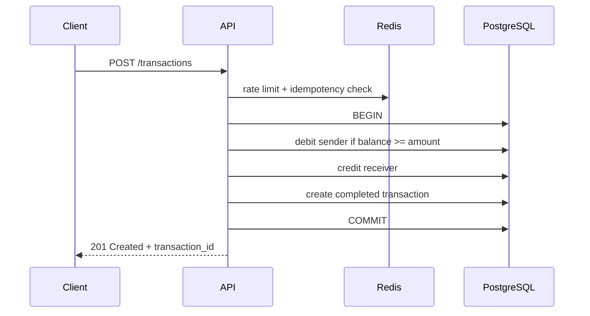

ч# Payment Processing

Учебный backend-сервис для переводов между внутренними счетами. Проект моделирует
базовые задачи платёжного процессинга: атомарное изменение балансов, хранение
истории операций, идемпотентность запросов, аутентификацию и ограничение частоты
обращений к API.

> Проект находится в активной разработке и не предназначен для обработки
> реальных платежей.

## Возможности

- регистрация и аутентификация пользователей;
- access- и refresh-токены с ротацией и отзывом сессий;
- переводы между счетами в одной транзакции PostgreSQL;
- защита баланса от ухода в минус на уровне SQL и ограничения БД;
- точное хранение денежных значений без `float64`;
- история операций с пагинацией;
- защита операций от повторной обработки через idempotency key;
- sliding-window rate limiting в Redis с атомарным Lua-скриптом;
- структурированные логи;
- HTTP-, интеграционные и end-to-end тесты.

## Основной сценарий перевода



Списание, зачисление и создание записи о переводе выполняются в рамках одной
транзакции БД. Списание использует условный `UPDATE`, поэтому проверка остатка и
изменение баланса происходят атомарно. Дополнительно PostgreSQL запрещает
отрицательные балансы через `CHECK` constraint.

Суммы хранятся в `NUMERIC(36, 18)` и представлены отдельным decimal-типом на
стороне приложения.

## Архитектура

Проект разделён на четыре основных слоя:

```text
cmd/server                  сборка приложения и HTTP-маршруты
internal/delivery/http      хендлеры, DTO и middleware
internal/usecase            прикладные сценарии
internal/domain             сущности и контракты
internal/infrastructure     PostgreSQL, Redis, конфигурация и логирование
migrations                  SQL-миграции
e2e                         end-to-end тесты с Testcontainers
```

Зависимости направлены к доменному слою. Usecase-сервисы работают с хранилищем
и кэшем через интерфейсы, а управление SQL-транзакцией вынесено в Unit of Work.

## API

Защищённые маршруты принимают access-токен в заголовке:

```http
Authorization: Bearer <access_token>
```

| Метод | Маршрут | Назначение | Авторизация |
|---|---|---|---|
| `POST` | `/auth/register` | Регистрация | Нет |
| `POST` | `/auth/login` | Вход | Нет |
| `POST` | `/auth/refresh` | Обновление пары токенов | Refresh token |
| `POST` | `/auth/logout` | Отзыв текущей сессии | Да |
| `POST` | `/auth/logout-all` | Отзыв всех сессий пользователя | Да |
| `GET` | `/accounts/{id}` | Получение своего аккаунта | Да |
| `GET` | `/accounts/{id}/transactions` | История операций | Да |
| `POST` | `/transactions` | Перевод между счетами | Да |
| `GET` | `/transactions/{id}` | Получение операции по ID | Да |

### Пример перевода

```http
POST /transactions HTTP/1.1
Authorization: Bearer <access_token>
Idempotency-Key: 7ed9dd10-36ca-4fca-9409-34c4f312650c
Content-Type: application/json

{
  "receiver_id": "6655f645-7754-48ef-9171-92557e7c6bf0",
  "amount": "125.50"
}
```

Успешный ответ:

```json
{
  "transaction_id": "0064df25-13b2-11f1-8000-c3375ccdf378"
}
```

Денежные значения передаются строками, чтобы клиент не терял точность при
сериализации.

## Технологии

- Go, стандартный `net/http`;
- PostgreSQL и `database/sql` с драйвером pgx;
- Redis;
- JWT и bcrypt;
- Goose для миграций;
- Testify, miniredis и Testcontainers;
- Docker Compose;
- GitHub Actions.

## Тестирование

Быстрые тесты и статическая проверка:

```bash
go test ./internal/...
go vet ./...
```

HTTP-хендлеры проверяются табличными тестами с моками usecase-слоя. Redis
проверяется через miniredis.

End-to-end тесты поднимают настоящие PostgreSQL и Redis в Docker, применяют
миграции и выполняют запросы к тестовому HTTP-серверу:

```bash
go test ./e2e/...
```

Для запуска e2e необходим работающий Docker Engine.

## Конфигурация

Приложение использует переменные окружения:

| Переменная | Назначение | Значение по умолчанию |
|---|---|---|
| `ENVIRONMENT` | Окружение приложения | `development` |
| `LOG_LEVEL` | Уровень логирования | `info` |
| `POSTGRES_HOST` | Адрес PostgreSQL | `localhost` |
| `POSTGRES_PORT` | Порт PostgreSQL | `5432` |
| `POSTGRES_DB` | Имя базы | `postgres_bd` |
| `POSTGRES_USER` | Пользователь БД | `admin` |
| `POSTGRES_PASSWORD` | Пароль БД | `secret` |
| `POSTGRES_SSL` | Режим SSL | `disable` |
| `REDIS_HOST` | Адрес Redis | `localhost` |
| `REDIS_PORT` | Порт Redis | `6379` |
| `REDIS_USER` | Пользователь Redis | пусто |
| `REDIS_PASSWORD` | Пароль Redis | пусто |
| `REDIS_RATE_LIMIT_MIN` | Лимит запросов в минуту | `20` |
| `REDIS_RATE_LIMIT_HOUR` | Лимит запросов в час | `100` |
| `REDIS_RATE_LIMIT_DAY` | Лимит запросов в сутки | `500` |
| `accessSecretKey` | Ключ подписи access-токенов | — |
| `refreshSecretKey` | Ключ подписи refresh-токенов | — |

Примеры конфигурации находятся в `cmd/server/.env.example` и
`internal/delivery/http/jwt/.env.example`.

## Статус проекта

Реализован основной синхронный сценарий перевода, управление аккаунтами и
жизненным циклом сессий. Ближайшие задачи:

- подготовить воспроизводимый локальный запуск через Docker Compose;
- усилить семантику идемпотентности с сохранением результата операции;
- добавить graceful shutdown и HTTP timeouts;
- включить e2e-тесты в CI;
- покрыть usecase-слой и decimal отдельными unit-тестами;
- проработать асинхронную обработку событий транзакций.
